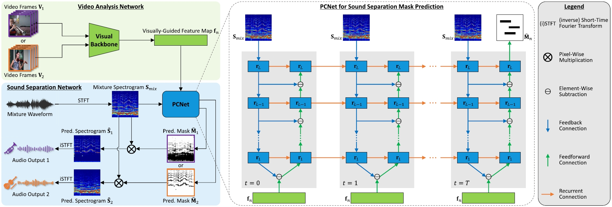

## Audio-Visual Predictive Coding (AVPC)
This repository provides a PyTorch implementation of [AVPC](https://arxiv.org/pdf/2306.10684), which can be used to separate musical instrument sounds when the corresponding video frames are available. <br/>


## Paper
Visually Guided Sound Source Separation with Audio-Visual Predictive Coding <br/>
[Zengjie Song](https://zjsong.github.io/)<sup>1</sup>, [Zhaoxiang Zhang](https://zhaoxiangzhang.net/)<sup>2</sup> <br/>
<sup>1</sup>School of Mathematics and Statistics, Xi’an Jiaotong University, Xi’an, China <br/>
<sup>2</sup>New Laboratory of Pattern Recognition, Institute of Automation, Chinese Academy of Sciences, Beijing, China <br/>
IEEE Transactions on Neural Networks and Learning Systems (T-NNLS), 2023 <br/>
[PDF](https://ieeexplore.ieee.org/abstract/document/10180219) | [arXiv](https://arxiv.org/pdf/2306.10684) <br/>

> **Abstract:** *The framework of visually guided sound source separation generally consists of three parts: visual feature extraction, multimodal feature fusion, and sound signal processing. An ongoing trend in this field has been to tailor involved visual feature extractor for informative visual guidance and separately devise module for feature fusion, while utilizing U-Net by default for sound analysis. However, such a divide-and-conquer paradigm is parameter-inefficient and, meanwhile, may obtain suboptimal performance as jointly optimizing and harmonizing
various model components is challengeable. By contrast, this article presents a novel approach, dubbed audio-visual predictive coding (AVPC), to tackle this task in a parameter-efficient and more effective manner. The network of AVPC features a simple ResNet-based video analysis network for deriving semantic visual features, and a predictive coding (PC)-based sound separation network that can extract audio features, fuse multimodal information, and predict sound separation masks in the same architecture. By iteratively minimizing the prediction error between features, AVPC integrates audio and visual information recursively, leading to progressively improved performance. In addition, we develop a valid self-supervised learning strategy for AVPC via copredicting two audio-visual representations of the same sound source. Extensive evaluations demonstrate that AVPC
outperforms several baselines in separating musical instrument sounds, while reducing the model size significantly.*




## Dependencies
We have tested the code on the following environment:
* Python 3.9.18 | PyTorch 2.0.0 | torchvision 0.15.0 | torchaudio 2.0.0 | CUDA 11.8 | Ubuntu 20.04.4


## Download & pre-process videos
We train and test models on respectively two music video datasets: [MUSIC-11 and MUSIC-21](https://github.com/roudimit/MUSIC_dataset), as well as showing some qualitative results on [URMP](https://labsites.rochester.edu/air/projects/URMP.html). Videos are downloaded with [youtube-dl](https://github.com/ytdl-org/youtube-dl) if only the YouTube IDs are given. Please see main text (Sec. V-A) for details of pre-processing video frames and audio signals. To accelerate data loading, we divide the whole audio from each video into 20-second segments. <br/>

We provide the information of MUSIC-11 training, validation, and test data in ```data/train516.csv```, ```data/val11.csv```, and ```data/test11.csv```, respectively. In each ```.csv``` file, the first column shows the path of audio segments; the second column presents the path of video frames; the third column displays the number of audio segments; and the fourth column gives the number of video frames. 


## Training
To train AVPC's on MUSIC-11 with the default setting, simply run:
```
python main.py
```
**Note**: For both model training and test, you need to specify the system environment in the function ```main()```.


## Test
After training, ```frame_best.pth``` and ```sound_best.pth``` can be obtained, and you need to place them in ```models/pretrained_models/``` before test. To test AVPC's on MUSIC-11 with the default setting, simply run:
```
python test.py
```


## Citation
Please consider citing our paper in your publications if the project helps your research.
```
@article{song2023visually,
  title={Visually Guided Sound Source Separation With Audio-Visual Predictive Coding},
  author={Song, Zengjie and Zhang, Zhaoxiang},
  journal={IEEE Transactions on Neural Networks and Learning Systems},
  year={2023}
}
```


## Acknowledgement
Our code is developed based on [Sound-of-Pixels](https://github.com/hangzhaomit/Sound-of-Pixels). We thank the authors for sharing their code. We also thank [Xudong Xu](https://sheldontsui.github.io/) for his valuable suggestions of accelerating data loading. 
